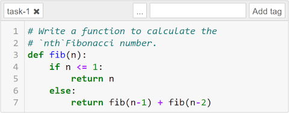
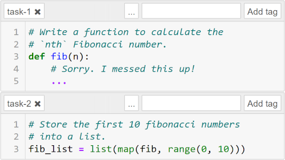
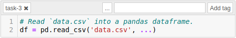

# JPTest
JPTest is a unit testing framework for Jupyter Notebooks and aims for fast test writing in less lines of code. It creates the possibility to score and automatically grade exams with separate notebook (`.ipynb`) and test (`.py`) files.

JPTest uses [testbook](https://github.com/nteract/testbook) by *nteract* for interaction with notebooks. While we mainly focus on grading, testbook might fit your use case better. So please feel free to watch [this presentation on YouTube](https://youtu.be/FseNNGmmrGs) by *Rohit Sanjay* if you want to know more about testbook.


## Installation
JPTest relies on [testbook](https://github.com/nteract/testbook) and [Jupyter](https://jupyter.org/). If you need any other libraries for executing your notebook cells they can be installed in your environment the usual way.

The preferred way to use JPTest is in a virtual environment:

```bash
python -m venv venv
source venv/bin/activate
```

Use `pip` to download and install JPTest:

```bash
pip install jptest
```


## Usage
You may use the decorator `@JPTest` with any function within a test file. It accepts the following parameters. Any other named parameters are copied to the JPTestBook object.

| name        | type                            | description                                                    |
| ----------- | ------------------------------- |----------------------------------------------------------------|
| `name`      | str                             | name used in the output                                        |
| `max_score` | float                           | maximum score (can be exceeded, used to calculate total score) |
| `execute`   | see [below](#execute-parameter) | cells or code to execute prior to the test                     |
| `timeout`   | int                             | execution timeout in seconds (default: 2 minutes)              |

`yield` can be used to grant points:

```python
yield condition: bool, value: float, [comment if True: str, [comment if False: str]]
```

Run the `jptest` module with the notebook and test file as parameters. Every test with the decorator is automatically discovered and executed.

```bash
python -m jptest notebook.ipynb tests.py
```

For more parameters see the included help:

```bash
python -m jptest --help
```

### Useful Functions
| name  | description                                                |
| ----- | ---------------------------------------------------------- |
| `ref` | get a reference to an object or function                   |
| `get` | like `ref`, but copy to a name with a random suffix before |

### Examples
#### a simple unit test


```python
# Mark as unit test and execute the cell with the tag `task-1`
# prior to this test function.
@JPTest('Task 1', max_score=2.0, execute=('task-1',))
def test_task1(tb: JPTestBook):
    # Use `ref` to reference an object or function from
    # the notebook.
    fib_from_nb = tb.ref('fib')

    # Grant points if output matches.
    yield fib_from_nb(0) == 0, 0.5
    yield fib_from_nb(1) == 1, 0.5
    yield fib_from_nb(2) == 1, 0.5
    yield fib_from_nb(20) == 6765, 0.5
```

#### independent grading


```python
@JPTest('Task 2', max_score=1.0, execute=[
    # Inject a correct `fib` function instead of executing the
    # cell with the tag `task-1`.
    '''
    def fib(n):
        if n <= 1:
            return n
        else:
            return fib(n-1) + fib(n-2)
    ''',
    # Execute the cell with the tag `task-2` only.
    ('task-2',)
])
def test_task2(tb: JPTestBook):
    yield tb.ref('fib_list') == [0, 1, 1, 2, 3, 5, 8, 13, 21, 34], 1.0
```

#### track function calls
```python
@JPTest('Bonus Point', max_score=2.0, execute=('task-1',))
def test_recursive(tb: JPTestBook):
    fib_from_nb = tb.ref('fib')

    # Track calls of `fib` function and store them into `params`
    # after the context manager's `__exit__` function is executed.
    with tb.track('fib') as params:
        fib_from_nb(20)

    # Award a bonus point if the function is recursive.
    yield len(params) > 1000, 1.0, None, 'recursion... neat!'
```

#### equality functions


Some objects like pandas dataframes are neither serializable nor comparable via `==`. One can call functions like `equals` on references instead.

```python
@JPTest('Task 3', max_score=2.0, execute=('task-3',))
def test_task3(tb: JPTestBook):
    # Store `df` with a random suffix and get a reference.
    result = tb.get('df')

    # Inject sample solution and get a reference.
    test = tb.inject('df = pd.read_csv("data.csv", ...)', 'df')

    # Call `equals` function on one of the dataframes.
    yield test.equals(result), 1.0

    # This also works with imported modules.
    # yield, tb.ref('nx').could_be_isomorphic(test, result), 1.0
```


## Execute Parameter
One can control in detail what code is executed prior to a test. Therefore the `execute` parameter accepts different types, which can also be nested recursively.

#### String
If the parameter is of type `str`, the value is considered as code and injected into the notebook.

#### Tuple
If the parameter is of type `tuple`, the value is considered as tags. If there is one element in the tuple, every cell with this tag is executed. If there are two elements in the tuple, every cell between the first appearence of the first tag and the first appearence of the second tag (including) is executed.

#### Dictionary
If the parameter is of type `dict`, it must include a key named `execute`, which value is executed following the rules stated in this section.

It may include a key named `track`, which value is another dictionary with function names as key and a tuple or a list of tuples containing the parameters to track. The result is passed to the test function as a parameter in the order of the execution.

#### Function
If the parameter is a function (`Callable`), it will be called with the JPTestBook object as a parameter.

#### List
If the parameter is of type `list`, every element will be executed in the order of its appearence, following the rules stated above.
